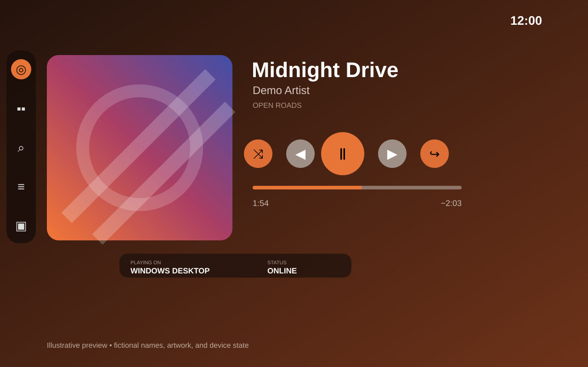
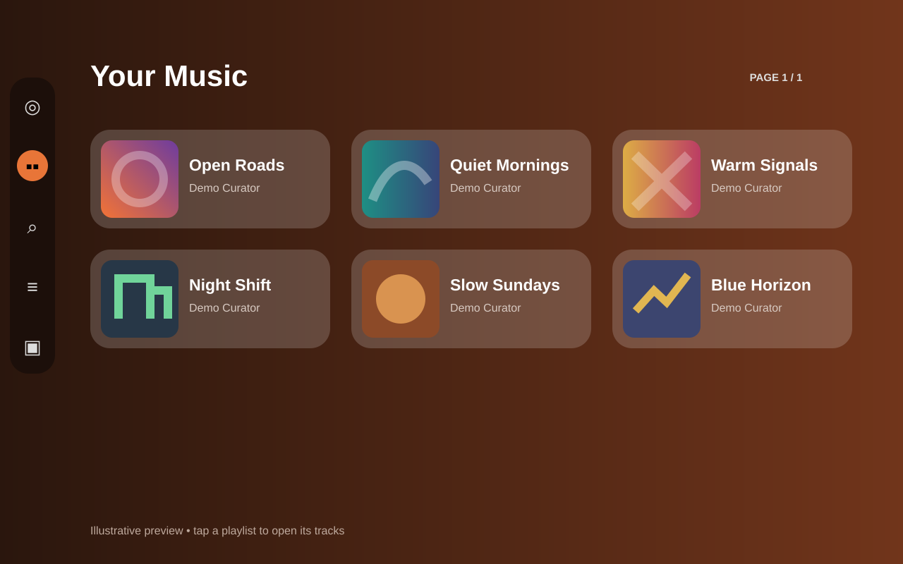
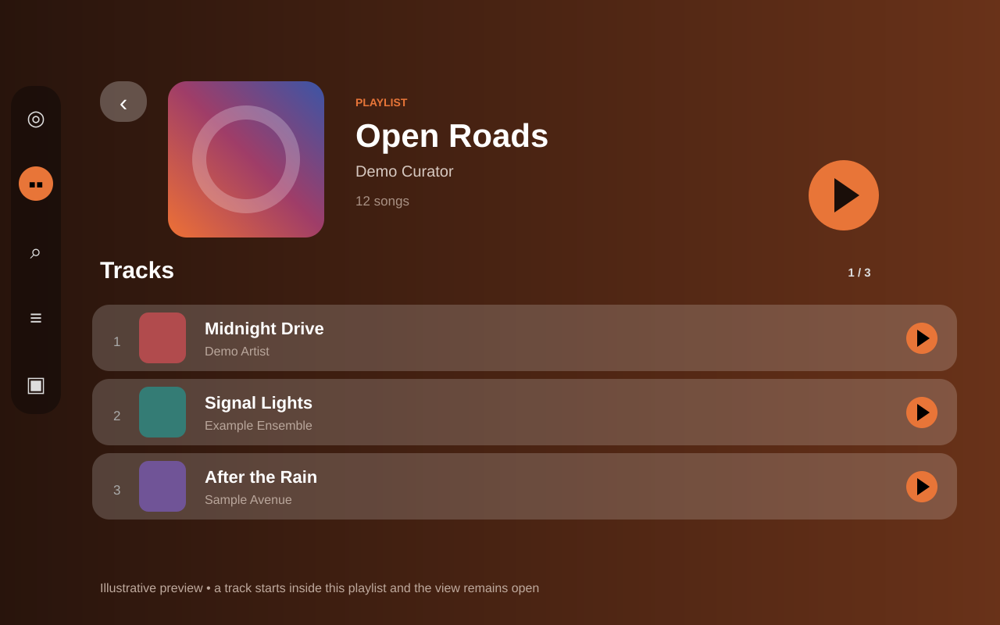
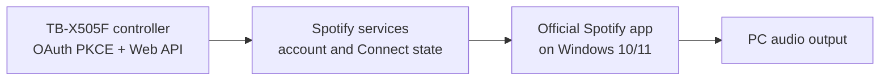

# Spotify Car Controller for Lenovo TB-X505F

A rootless Android 10 kiosk and Spotify Connect controller that turns a Lenovo Tab M10 HD (TB-X505F) into a dedicated Car Thing-style dashboard for Spotify running on Windows.

The recommended deployment is **stock Android 10 + this app as the Home launcher + Device Owner + lock-task mode**. Android stays installed underneath the interface. No root, custom ROM, bootloader unlock, firmware flash, tablet Spotify installation, or Windows companion service is required.

> [!CAUTION]
> This project is tested only on the **Lenovo TB-X505F running stock Android 10 in landscape at 1280×800**. The included ADB scripts refuse other tablet models.

> This is an independent personal controller and is not affiliated with Spotify or Lenovo. It contains no Spotify software, credentials, music, or third-party album artwork.

## Downloads and installation

- New users: follow the [beginner Windows 10/11 installation tutorial](docs/INSTALL_WINDOWS_BEGINNER.md).
- Stable APKs: use the [latest signed GitHub Release](../../releases/latest) and verify its `SHA256SUMS.txt`. Until a signed release exists, build from source instead of downloading repackaged APKs.
- Test APKs: successful `main` builds expose a short-lived debug artifact in GitHub Actions.
- Maintainers: read the [signed release guide](docs/RELEASING.md).

Release APKs must always use the same private signing key so Android can install future updates in place. The key and passwords never belong in this repository.

## Interface previews

| Now Playing | Playlist library |
|:--:|:--:|
|  |  |

### Playlist detail



These vector previews reproduce the app's 1280×800 layout. Every name, artwork, playback value, device state, and timestamp is fictional.

## What works

- Custom Home launcher, boot startup, immersive full screen, Device Owner, and lock-task kiosk mode
- PIN-protected hidden administrator menu by holding the top-right clock area for 2.5 seconds
- Safe dedicated-mode exit that restores system bars, keyguard behavior, and Home-app selection
- Spotify Authorization Code with PKCE; no Client Secret is stored or used
- AES-GCM token encryption using an Android Keystore key
- Direct control of the official Spotify desktop app through Spotify Connect and the Web API
- Play/pause, previous/next, seek, shuffle, repeat, save/unsave, volume, and playback-device selection
- Playlist library with an in-app, Spotify-style playlist/album detail screen
- Context-preserving track selection: choosing a track inside a playlist keeps that playlist active
- Context-preserving Up Next selection: choosing a queued playlist/album track does not replace the queue with a one-song session
- Search, queue, recently played, opt-in synchronized/plain lyrics, and artwork-adaptive styling
- Remembered Windows device name with automatic Spotify device-ID refresh
- Wi-Fi high-performance lock, offline recovery, charging-only screen wake, inactivity dimming, and blackout mode
- Boot receiver and crash-restart alarm
- Conservative, optional, reversible ADB debloat scripts

## How it works



The tablet authenticates through the browser, stores encrypted access and refresh tokens, and sends playback commands to Spotify. Spotify routes those commands to the selected Windows Spotify Connect device. The controller never streams audio.

During OAuth return, the app temporarily listens only on the tablet's non-routable `127.0.0.1:25566` loopback address. It opens no LAN or internet-facing server.

## Playlist and Up Next behavior

Tapping a playlist or album opens its tracks inside the app. The detail view provides:

- playlist/album artwork, title, owner/artist, and track count;
- a Play button for the complete context;
- numbered, paginated track rows; and
- a Back button that returns to the previous Library or Search screen.

Tapping a track in that view uses Spotify's `context_uri` plus `offset.uri`, so playback starts at that track while the full playlist or album remains active.

Up Next uses the active playback context reported by Spotify. If the selected queue track belongs to an active playlist or album, the controller jumps to it without replacing the context and keeps the Up Next screen open. Spotify does not expose an arbitrary “jump to queue index” API; when no compatible context exists, the app refuses the destructive one-track fallback and asks the user to open a playlist or album first.

## Hardware and software requirements

- Lenovo TB-X505F on official Android 10
- Landscape orientation and 1280×800 display
- Windows 10 or Windows 11
- Current [Google Android Platform-Tools](https://developer.android.com/tools/releases/platform-tools)
- Official Spotify desktop app on Windows
- Spotify Premium for player-control endpoints
- A personal Spotify Developer application and its public Client ID
- For source builds: JDK 17, Android SDK Platform 35, and Android SDK Build Tools
- For full Device Owner mode: a factory-reset tablet with no Google, Lenovo, work, or other user accounts

Spotify Development Mode rules can change. Under the 2026 rules, the developer-app owner needs Premium and a personal Development Mode app supports only a small authorized-user list.

## Build from source

1. Install JDK 17 and Android Studio.
2. In Android Studio's SDK Manager, install Android SDK Platform 35 and current Build Tools.
3. Clone this repository.
4. Copy `local.properties.example` to `local.properties` and replace `YOUR_USERNAME` with the local Windows account name, or let Android Studio create the file.
5. From PowerShell in the repository root, run:

   ```powershell
   .\gradlew.bat clean check assembleDebug
   ```

6. The installable debug APK is:

   ```text
   app\build\outputs\apk\debug\app-debug.apk
   ```

The checked-in Gradle wrapper is the supported entry point; a separate Gradle installation is unnecessary. CI validates the wrapper, runs unit tests and Android lint, builds the debug APK, and uploads it as a temporary Actions artifact.

For a signed release, keep the keystore outside this repository and run:

```powershell
.\scripts\build-release.ps1 -KeyStore 'C:\secure\controller-release.jks' -KeyAlias 'controller'
```

Passwords are requested through masked prompts and are not written to disk. See [RELEASING.md](docs/RELEASING.md) before creating a tag.

## Spotify Developer application

1. Sign in to the [Spotify Developer Dashboard](https://developer.spotify.com/dashboard) with the Premium account that owns the integration.
2. Create an application and select the **Web API**.
3. Add this redirect URI exactly:

   ```text
   http://127.0.0.1:25566/callback
   ```

4. Copy the public **Client ID** into the app's administrator menu.
5. Never copy, enter, or commit the Client Secret.
6. Add any other permitted Spotify accounts under the developer application's authorized users.

The app uses Authorization Code with PKCE, which is designed for public mobile clients without an embedded secret.

## Safe pilot installation

Before factory-resetting anything, test launcher mode:

```powershell
.\scripts\install-apk.ps1 -Apk 'C:\path\to\controller.apk'
.\scripts\grant-supported-permissions.ps1
.\scripts\enable-autostart.ps1
```

Press Home on the tablet and choose **Car Thing Controller → Always**. Configure the administrator PIN, Spotify Client ID/account, and preferred Windows PC. This mode is reversible and does not erase data, but Android system surfaces remain more accessible than in Device Owner mode.

## Full dedicated mode

> [!WARNING]
> Device Owner provisioning normally requires a factory reset, which erases tablet applications, accounts, files, and settings. Complete the backup procedure first.

```powershell
.\scripts\backup-before-reset.ps1 -IncludeSharedStorage
```

Read [Device mode, backup, ROM decision, and rollback](docs/DEVICE_MODE.md). After the reset, skip all account enrollment, re-enable USB debugging, reinstall the APK, and run:

```powershell
.\scripts\grant-supported-permissions.ps1
.\scripts\configure-device-owner.ps1
.\scripts\enable-autostart.ps1
```

The Device Owner script displays the change and requires uppercase `YES`. Reboot at least twice and test Wi-Fi reconnection, direct launch, hidden system bars, lock-task confinement, and Spotify control before considering optional debloat.

## Optional debloat

Debloating is not required for kiosk operation. The optional script:

- verifies the exact TB-X505F model;
- detects only a small fixed allowlist of nonessential user-facing apps;
- shows the exact packages before changing anything;
- requires uppercase `YES`;
- uses reversible `pm disable-user --user 0`; and
- records exactly what it changed.

```powershell
.\scripts\debloat-optional.ps1
.\scripts\restore-disabled-packages.ps1
```

System UI, Settings, Wi-Fi, Package Installer, WebView, Chrome, Play services, Play Store, Lenovo launcher/update/recovery, and ambiguous Lenovo services are deliberately excluded.

## Updating

Download a newer APK from the official Releases page, verify its checksum, and run:

```powershell
.\scripts\install-apk.ps1 -Apk 'C:\path\to\new-version.apk'
```

The script uses `adb install -r`, which preserves app data when the APK has the same application ID and signing key. Never uninstall first when updating. Stop if Android reports a signature mismatch.

## Restore normal Android

1. Hold the top-right clock area for 2.5 seconds.
2. Enter the administrator PIN.
3. Choose **Exit dedicated mode** and confirm.
4. Select Lenovo Launcher in Android Home-app settings.
5. Connect ADB and run:

   ```powershell
   .\scripts\uninstall-and-restore.ps1
   ```

The script restores packages recorded by optional debloat and removes the controller. If the PIN is lost while Device Owner is active, a stock recovery factory reset is the supported last-resort escape; it erases user data but requires no flashing.

## Known limitations

- Spotify Premium is required for player control.
- The official Spotify client must be open and online on the playback device.
- Spotify player state is polled; the Web API does not push every playback event.
- Up Next exposes track objects but not a queue context or arbitrary queue-index jump. Context-preserving selection therefore requires an active playlist or album.
- Development Mode may limit playlist item access to playlists the user owns or collaborates on.
- Lyrics are disabled by default. If enabled, the app sends track, artist, album, and duration metadata—not Spotify credentials—to LRCLIB over HTTPS; results may be missing, delayed, or incorrect.
- A personal Development Mode application is not a supported basis for a commercial product.
- This project does not recommend or include bootloader unlocking, custom recovery, firmware, or a custom ROM.

## Project layout

- `app/` — Kotlin Android application source, resources, and tests
- `scripts/` — model-gated install, provisioning, backup, debloat, restore, and uninstall tools
- `config/` and `.env.example` — public placeholders only
- `docs/` — architecture, device-mode research, beginner installation, release process, and troubleshooting
- `.github/workflows/` — pinned CI and encrypted-secret signed-release automation

## Security, license, and attribution

Do not commit Spotify tokens, a Client Secret, signing files, tablet backups, ADB logs, or real-device configuration. See [SECURITY.md](SECURITY.md) for private vulnerability reporting.

The project is licensed under the [Apache License 2.0](LICENSE). Dependencies, services, trademarks, lyrics-provider information, and preview provenance are documented in [THIRD_PARTY_NOTICES.md](THIRD_PARTY_NOTICES.md).

Further documentation:

- [Beginner Windows installation](docs/INSTALL_WINDOWS_BEGINNER.md)
- [Architecture](docs/ARCHITECTURE.md)
- [Device/ROM decision, backup, and rollback](docs/DEVICE_MODE.md)
- [Troubleshooting](docs/TROUBLESHOOTING.md)
- [Maintainer release process](docs/RELEASING.md)
